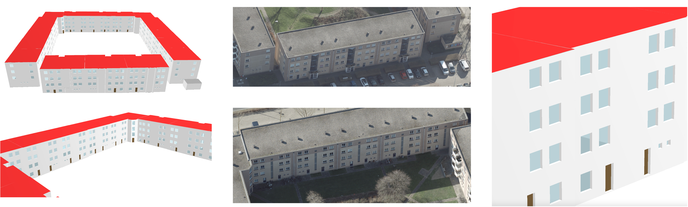
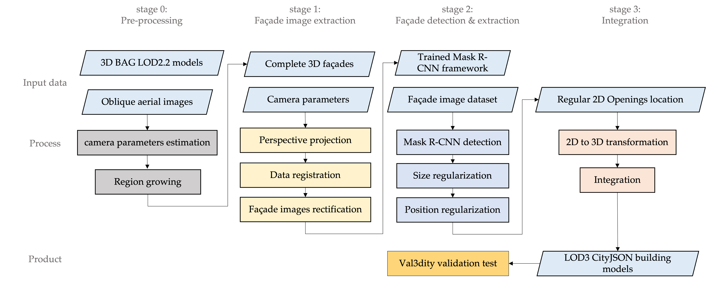
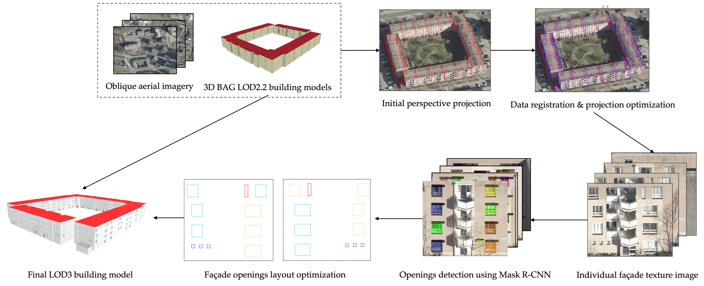

# Add openings to 3D BAG LOD2.2 buidlding model
___
### Introduction
This is the Master Graduation Project of Yitong Xia at Faculty of Architecture, TU Delft, and this project is to reconstruct LOD3 building model utilizing oblique aerial imagery and 3D BAG LOD2.2 building model. '

In this repository, a pipeline is presented to add window and door geometries to the current 3D building model, by using oblique aerial imagery. The figure below shows the proposed pipeline. The first stage is to apply perspective projection to extract the corresponding texture image of each individual 3D facade from oblique aerial imagery and rectify them.
In the second stage, Mask R-CNN is trained to detect the openings from the extracted façade texture images. In the third stage, the obtained window and door primitives are converted from 2D to 3D and integrated them into the 3D building models.


The original [thesis](https://repository.tudelft.nl/islandora/object/uuid%3Aeaff38b9-65f4-4c1c-8cec-aebd8fc4b18f?collection=education) is here.


___
### Project Structure:

- `stage 1`: 
  - data registration model creation
  - data registration, image extraction and rectification
- `stage 2`:
  - Mask R-CNN detection (in colab)
- `stage 3`:
  - final integration of 2D extracted openings & 3D building models


___
### input data and infomation:
- `imagery dataset`
- `original LOD2.2 building model` (after region growing algorithm)
- `LOD2.2 building model after surface merging` (saved as a new file in surface_merge.py)
- `calibrated camera parameters of single imagery`:
  - fileName imageWidth imageHeight 
  - camera matrix K [3x3]
  - radial distortion [3x1]
  - tangential distortion [2x1]
  - camera position t [3x1]
  - camera rotation R [3x3]
  - camera model m = K [R|-Rt] X
- `external camera parameters`
  - imageName, X, Y, Z, Omega, Phi, Kappa
- `offset value`:
  - X, Y, Z
- `a LOD3 CityJSON template file`
- `openings detection result` (in coco format, automatically generated)

___
### Description of output files
`../result/LOD3_model.json`

___
### Required dependencies
```angular2html
conda install -c conda-forge scikit-learn
conda install -c conda-forge opencv
conda install -c conda-forge matplotlib
conda install -c anaconda numpy
```